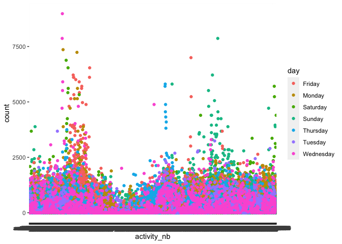

P8105_hw3_REN XIN
================
2022-10-12

``` r
library(tidyverse)
```

    ## ── Attaching packages ─────────────────────────────────────── tidyverse 1.3.2 ──
    ## ✔ ggplot2 3.3.6      ✔ purrr   0.3.4 
    ## ✔ tibble  3.1.8      ✔ dplyr   1.0.10
    ## ✔ tidyr   1.2.0      ✔ stringr 1.4.1 
    ## ✔ readr   2.1.2      ✔ forcats 0.5.2 
    ## ── Conflicts ────────────────────────────────────────── tidyverse_conflicts() ──
    ## ✖ dplyr::filter() masks stats::filter()
    ## ✖ dplyr::lag()    masks stats::lag()

``` r
library(readxl)
library(readr)
library(dplyr)
library(p8105.datasets)
library(ggplot2)
```

``` r
devtools::install_github("p8105/p8105.datasets",force = TRUE)
```

    ## Downloading GitHub repo p8105/p8105.datasets@HEAD

    ## * checking for file ‘/private/var/folders/ss/xwgx9pt14yj9kprlxylpgsp40000gn/T/Rtmph7BRKs/remotesa51b4795569/P8105-p8105.datasets-412759e/DESCRIPTION’ ... OK
    ## * preparing ‘p8105.datasets’:
    ## * checking DESCRIPTION meta-information ... OK
    ## * checking for LF line-endings in source and make files and shell scripts
    ## * checking for empty or unneeded directories
    ## * building ‘p8105.datasets_0.0.1.tar.gz’

``` r
data("instacart")
```

Problem 2:

``` r
Accel = 
  read_excel("accel_data.xlsx")
Accel_2 = Accel %>%
  mutate(weekday = case_when(
    day == "Monday" ~ "weekday",
    day == "Tuesday" ~ "weekday",
    day == "Wednesday" ~ "weekday",
    day == "Thursday" ~ "weekday",
    day == "Friday" ~ "weekday",
    day == "Saturday" ~ "weekend",
    day == "Sunday" ~ "weekend",
    TRUE  ~""
  ))
```

``` r
Accel_2=
  mutate(
    Accel, sum=rowSums(Accel[4:1443], na.rm = TRUE)
  )
Accel_2=Accel_2 %>%
  pivot_longer(activity.1:activity.1440,names_to = "activity_nb", values_to = "count")

ggplot(Accel_2,aes(x=activity_nb, y=count , color = day ))+
  geom_point()
```

<!-- -->

Description: The Accel_2 has ‘nrow(Accel_2)’ row and ‘ncol(Accel_2)’
columns.The variables included week, day_id, day,sum, activity_nb,
counnt. There are ‘nrow(Accel_2)’ observations in total. There are no
apparent trend.

Problem 3

``` r
devtools::install_github("p8105/p8105.datasets", force = TRUE)
```

    ## Downloading GitHub repo p8105/p8105.datasets@HEAD

    ## * checking for file ‘/private/var/folders/ss/xwgx9pt14yj9kprlxylpgsp40000gn/T/Rtmph7BRKs/remotesa51b6ba1d26c/P8105-p8105.datasets-412759e/DESCRIPTION’ ... OK
    ## * preparing ‘p8105.datasets’:
    ## * checking DESCRIPTION meta-information ... OK
    ## * checking for LF line-endings in source and make files and shell scripts
    ## * checking for empty or unneeded directories
    ## * building ‘p8105.datasets_0.0.1.tar.gz’

``` r
library(p8105.datasets)
data("ny_noaa")
```

``` r
nrow(ny_noaa)
```

    ## [1] 2595176

``` r
ncol(ny_noaa)
```

    ## [1] 7

Description: This dataset(ny_noaa) has ‘nrow(ny_noaa)’ row and
‘ncol(ny_noaa)’ columns. There are total 7 row, which are
id、date、prcp、snow、snwd 、tmax and tmin.Those are key Variables. Each
row represent the weather of NY from ‘1981-01-01’ to ‘2010-12-31’. There
are also some data missing. Find out how much data is missing are
’table(is.na(ny_noaa$prcp))'、table(is.na(ny_noaa$snow))、table(is.na(ny_noaa$snwd))、table(is.na(ny_noaa$tmax))、table(is.na(ny_noaa\$tmin)).

``` r
ny_noaa_clearn = separate(ny_noaa,date, into= c("year","month",'day'),sep= "-")
ny_noaa_snow = as.data.frame(table(ny_noaa_clearn$snow))
```

Description: the most commonly observed values is O, which appear
2008508 times.The reason why 0 is the most commonly is the weather of
snow and low temperature are unusual in one year.

Ny_noaa_Jan and July

``` r
ny_noaa_clearn= ny_noaa_clearn %>% 
  mutate(
  month=as.double(month),
  year=as.double(year)
)
ny_noaa_filt=ny_noaa_clearn %>% 
  filter(month==1|month==7)
```
