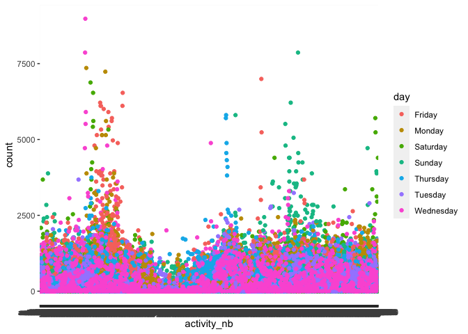
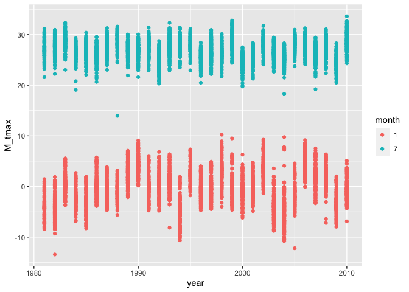
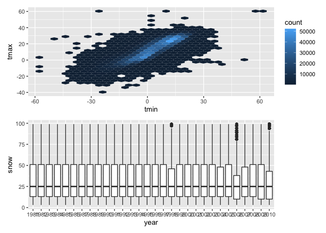

P8105_hw3_REN XIN
================
2022-10-15

``` r
library(tidyverse)
```

    ## ── Attaching packages ─────────────────────────────────────── tidyverse 1.3.2 ──
    ## ✔ ggplot2 3.3.6      ✔ purrr   0.3.4 
    ## ✔ tibble  3.1.8      ✔ dplyr   1.0.10
    ## ✔ tidyr   1.2.0      ✔ stringr 1.4.1 
    ## ✔ readr   2.1.2      ✔ forcats 0.5.2 
    ## ── Conflicts ────────────────────────────────────────── tidyverse_conflicts() ──
    ## ✖ dplyr::filter() masks stats::filter()
    ## ✖ dplyr::lag()    masks stats::lag()

``` r
library(readxl)
library(readr)
library(dplyr)
library(ggplot2)
```

devtools::install_github(“p8105/p8105.datasets”,force = TRUE)

``` r
library(p8105.datasets)
data("instacart")
```

### Problem 1 copy from Jeff

#### Read in the data

``` r
instacart = 
  instacart %>% 
  as_tibble(instacart)
```

#### Answer questions about the data

This dataset contains 1384617 rows and 15 columns, with each row
resprenting a single product from an instacart order. Variables include
identifiers for user, order, and product; the order in which each
product was added to the cart. There are several order-level variables,
describing the day and time of the order, and number of days since prior
order. Then there are several item-specific variables, describing the
product name (e.g. Yogurt, Avocado), department (e.g. dairy and eggs,
produce), and aisle (e.g. yogurt, fresh fruits), and whether the item
has been ordered by this user in the past. In total, there are 39123
products found in 131209 orders from 131209 distinct users.

Below is a table summarizing the number of items ordered from aisle. In
total, there are 134 aisles, with fresh vegetables and fresh fruits
holding the most items ordered by far.

``` r
instacart %>% 
  count(aisle) %>% 
  arrange(desc(n))
```

    ## # A tibble: 134 × 2
    ##    aisle                              n
    ##    <chr>                          <int>
    ##  1 fresh vegetables              150609
    ##  2 fresh fruits                  150473
    ##  3 packaged vegetables fruits     78493
    ##  4 yogurt                         55240
    ##  5 packaged cheese                41699
    ##  6 water seltzer sparkling water  36617
    ##  7 milk                           32644
    ##  8 chips pretzels                 31269
    ##  9 soy lactosefree                26240
    ## 10 bread                          23635
    ## # … with 124 more rows

Next is a plot that shows the number of items ordered in each aisle.
Here, aisles are ordered by ascending number of items.

``` r
instacart %>% 
  count(aisle) %>% 
  filter(n > 10000) %>% 
  mutate(aisle = fct_reorder(aisle, n)) %>% 
  ggplot(aes(x = aisle, y = n)) + 
  geom_point() + 
  labs(title = "Number of items ordered in each aisle") +
  theme(axis.text.x = element_text(angle = 60, hjust = 1))
```

<!-- -->

Our next table shows the three most popular items in aisles
`baking ingredients`, `dog food care`, and `packaged vegetables fruits`,
and includes the number of times each item is ordered in your table.

``` r
instacart %>% 
  filter(aisle %in% c("baking ingredients", "dog food care", "packaged vegetables fruits")) %>%
  group_by(aisle) %>% 
  count(product_name) %>% 
  mutate(rank = min_rank(desc(n))) %>% 
  filter(rank < 4) %>% 
  arrange(desc(n)) %>%
  knitr::kable()
```

| aisle                      | product_name                                  |    n | rank |
|:---------------------------|:----------------------------------------------|-----:|-----:|
| packaged vegetables fruits | Organic Baby Spinach                          | 9784 |    1 |
| packaged vegetables fruits | Organic Raspberries                           | 5546 |    2 |
| packaged vegetables fruits | Organic Blueberries                           | 4966 |    3 |
| baking ingredients         | Light Brown Sugar                             |  499 |    1 |
| baking ingredients         | Pure Baking Soda                              |  387 |    2 |
| baking ingredients         | Cane Sugar                                    |  336 |    3 |
| dog food care              | Snack Sticks Chicken & Rice Recipe Dog Treats |   30 |    1 |
| dog food care              | Organix Chicken & Brown Rice Recipe           |   28 |    2 |
| dog food care              | Small Dog Biscuits                            |   26 |    3 |

Finally is a table showing the mean hour of the day at which Pink Lady
Apples and Coffee Ice Cream are ordered on each day of the week. This
table has been formatted in an untidy manner for human readers. Pink
Lady Apples are generally purchased slightly earlier in the day than
Coffee Ice Cream, with the exception of day 5.

``` r
instacart %>%
  filter(product_name %in% c("Pink Lady Apples", "Coffee Ice Cream")) %>%
  group_by(product_name, order_dow) %>%
  summarize(mean_hour = mean(order_hour_of_day)) %>%
  spread(key = order_dow, value = mean_hour) %>%
  knitr::kable(digits = 2)
```

    ## `summarise()` has grouped output by 'product_name'. You can override using the
    ## `.groups` argument.

| product_name     |     0 |     1 |     2 |     3 |     4 |     5 |     6 |
|:-----------------|------:|------:|------:|------:|------:|------:|------:|
| Coffee Ice Cream | 13.77 | 14.32 | 15.38 | 15.32 | 15.22 | 12.26 | 13.83 |
| Pink Lady Apples | 13.44 | 11.36 | 11.70 | 14.25 | 11.55 | 12.78 | 11.94 |

Problem 2:

``` r
Accel = 
  read_excel("accel_data.xlsx")
Accel_2 = Accel %>%
  mutate(weekday = case_when(
    day == "Monday" ~ "weekday",
    day == "Tuesday" ~ "weekday",
    day == "Wednesday" ~ "weekday",
    day == "Thursday" ~ "weekday",
    day == "Friday" ~ "weekday",
    day == "Saturday" ~ "weekend",
    day == "Sunday" ~ "weekend",
    TRUE  ~""
  ))
```

``` r
Accel_2=
  mutate(
    Accel, sum=rowSums(Accel[4:1443], na.rm = TRUE)
  )
Accel_2=Accel_2 %>%
  pivot_longer(activity.1:activity.1440,names_to = "activity_nb", values_to = "count")

ggplot(Accel_2,aes(x=activity_nb, y=count , color = day ))+
  geom_point()
```

<!-- -->

Description: The Accel_2 has ‘nrow(Accel_2)’ row and ‘ncol(Accel_2)’
columns.The variables included week, day_id, day,sum, activity_nb,
counnt. There are ‘nrow(Accel_2)’ observations in total. There are no
apparent trend.

devtools::install_github(“p8105/p8105.datasets”) Problem 3
devtools::install_github(“p8105/p8105.datasets”)

``` r
library(p8105.datasets)
data("ny_noaa")
```

``` r
nrow(ny_noaa)
```

    ## [1] 2595176

``` r
ncol(ny_noaa)
```

    ## [1] 7

Description: This dataset(ny_noaa) has ‘nrow(ny_noaa)’ row and
‘ncol(ny_noaa)’ columns. There are total 7 row, which are
id、date、prcp、snow、snwd 、tmax and tmin.Those are key Variables. Each
row represent the weather of NY from ‘1981-01-01’ to ‘2010-12-31’. There
are also some data missing. Find out how much data is missing are
’table(is.na(ny_noaa$prcp))'、table(is.na(ny_noaa$snow))、table(is.na(ny_noaa$snwd))、table(is.na(ny_noaa$tmax))、table(is.na(ny_noaa\$tmin)).

``` r
ny_noaa_clearn = separate(ny_noaa,date, into= c("year","month",'day'),sep= "-")
ny_noaa_clearn
```

    ## # A tibble: 2,595,176 × 9
    ##    id          year  month day    prcp  snow  snwd tmax  tmin 
    ##    <chr>       <chr> <chr> <chr> <int> <int> <int> <chr> <chr>
    ##  1 US1NYAB0001 2007  11    01       NA    NA    NA <NA>  <NA> 
    ##  2 US1NYAB0001 2007  11    02       NA    NA    NA <NA>  <NA> 
    ##  3 US1NYAB0001 2007  11    03       NA    NA    NA <NA>  <NA> 
    ##  4 US1NYAB0001 2007  11    04       NA    NA    NA <NA>  <NA> 
    ##  5 US1NYAB0001 2007  11    05       NA    NA    NA <NA>  <NA> 
    ##  6 US1NYAB0001 2007  11    06       NA    NA    NA <NA>  <NA> 
    ##  7 US1NYAB0001 2007  11    07       NA    NA    NA <NA>  <NA> 
    ##  8 US1NYAB0001 2007  11    08       NA    NA    NA <NA>  <NA> 
    ##  9 US1NYAB0001 2007  11    09       NA    NA    NA <NA>  <NA> 
    ## 10 US1NYAB0001 2007  11    10       NA    NA    NA <NA>  <NA> 
    ## # … with 2,595,166 more rows

``` r
ny_noaa_clearn=ny_noaa_clearn%>% 
  mutate(
    prcp = prcp / 10,
    month = as.integer(month),
    tmax = as.numeric(tmax) / 10, 
    tmin = as.numeric(tmin) / 10
    )
ny_noaa_snow = as.data.frame(table(ny_noaa_clearn$snow))
ny_noaa_snow
```

    ##      Var1    Freq
    ## 1     -13       1
    ## 2       0 2008508
    ## 3       3    8790
    ## 4       5    9748
    ## 5       8    9962
    ## 6      10    5106
    ## 7      13   23095
    ## 8      15    3672
    ## 9      18    3226
    ## 10     20    4797
    ## 11     23    1959
    ## 12     25   31022
    ## 13     28    2118
    ## 14     30    2814
    ## 15     33    2380
    ## 16     36    1630
    ## 17     38    9197
    ## 18     41    1467
    ## 19     43    1337
    ## 20     46    2123
    ## 21     48     918
    ## 22     51   18274
    ## 23     53    1155
    ## 24     56    1179
    ## 25     58    1198
    ## 26     61     849
    ## 27     64    4506
    ## 28     66     790
    ## 29     69     726
    ## 30     71    1075
    ## 31     74     463
    ## 32     76   10173
    ## 33     79     635
    ## 34     81     811
    ## 35     84     553
    ## 36     86     476
    ## 37     89    2535
    ## 38     91     428
    ## 39     94     404
    ## 40     97     704
    ## 41     99     276
    ## 42    102    6552
    ## 43    104     349
    ## 44    107     504
    ## 45    109     393
    ## 46    112     243
    ## 47    114    1578
    ## 48    117     276
    ## 49    119     248
    ## 50    122     411
    ## 51    124     183
    ## 52    127    3901
    ## 53    130     217
    ## 54    132     310
    ## 55    135     253
    ## 56    137     173
    ## 57    140     994
    ## 58    142     187
    ## 59    145     172
    ## 60    147     268
    ## 61    150     124
    ## 62    152    3131
    ## 63    155     186
    ## 64    157     209
    ## 65    160     149
    ## 66    163     133
    ## 67    165     614
    ## 68    168     115
    ## 69    170     104
    ## 70    173     187
    ## 71    175      80
    ## 72    178    1650
    ## 73    180      93
    ## 74    183     132
    ## 75    185     117
    ## 76    188      77
    ## 77    191     426
    ## 78    193      70
    ## 79    196      75
    ## 80    198     130
    ## 81    201      60
    ## 82    203    1475
    ## 83    206      74
    ## 84    208      98
    ## 85    211      69
    ## 86    213      58
    ## 87    216     292
    ## 88    218      55
    ## 89    221      53
    ## 90    224      61
    ## 91    226      35
    ## 92    229     744
    ## 93    231      43
    ## 94    234      52
    ## 95    236      49
    ## 96    239      39
    ## 97    241     192
    ## 98    244      36
    ## 99    246      37
    ## 100   249      58
    ## 101   251      21
    ## 102   254     786
    ## 103   257      34
    ## 104   259      48
    ## 105   262      28
    ## 106   264      24
    ## 107   267     130
    ## 108   269      19
    ## 109   272      22
    ## 110   274      45
    ## 111   277      20
    ## 112   279     369
    ## 113   282      28
    ## 114   284      37
    ## 115   287      22
    ## 116   290      24
    ## 117   292      81
    ## 118   295      20
    ## 119   297      14
    ## 120   300      24
    ## 121   302      22
    ## 122   305     451
    ## 123   307      17
    ## 124   310      29
    ## 125   312      22
    ## 126   315      13
    ## 127   318      70
    ## 128   320       7
    ## 129   323      22
    ## 130   325      12
    ## 131   328       6
    ## 132   330     226
    ## 133   333       9
    ## 134   335      13
    ## 135   338      17
    ## 136   340      13
    ## 137   343      63
    ## 138   345      17
    ## 139   348       6
    ## 140   351      15
    ## 141   353      12
    ## 142   356     235
    ## 143   358      12
    ## 144   361      15
    ## 145   363      14
    ## 146   366      15
    ## 147   368      32
    ## 148   371       4
    ## 149   373       6
    ## 150   376      12
    ## 151   378       5
    ## 152   381     139
    ## 153   384       6
    ## 154   386       8
    ## 155   389       5
    ## 156   391       1
    ## 157   394      27
    ## 158   396       5
    ## 159   399       4
    ## 160   401      10
    ## 161   404       7
    ## 162   406     116
    ## 163   409       6
    ## 164   411       8
    ## 165   414      12
    ## 166   417       9
    ## 167   419      15
    ## 168   422       5
    ## 169   424       3
    ## 170   427       8
    ## 171   429       1
    ## 172   432      63
    ## 173   434       7
    ## 174   437       8
    ## 175   439       3
    ## 176   445       8
    ## 177   447       5
    ## 178   450       5
    ## 179   452       5
    ## 180   455       4
    ## 181   457     100
    ## 182   460       5
    ## 183   462       3
    ## 184   465       5
    ## 185   467       6
    ## 186   470      20
    ## 187   472       4
    ## 188   475       5
    ## 189   478       4
    ## 190   480       2
    ## 191   483      44
    ## 192   488       4
    ## 193   490       2
    ## 194   495       3
    ## 195   498       2
    ## 196   503       2
    ## 197   505       2
    ## 198   508      54
    ## 199   511       2
    ## 200   513       3
    ## 201   516       2
    ## 202   518       3
    ## 203   521       8
    ## 204   523       2
    ## 205   526       2
    ## 206   528       2
    ## 207   533      16
    ## 208   536       1
    ## 209   544       1
    ## 210   546       6
    ## 211   549       4
    ## 212   551       2
    ## 213   554       4
    ## 214   556       1
    ## 215   559      35
    ## 216   561       2
    ## 217   564       2
    ## 218   566       1
    ## 219   569       1
    ## 220   572       3
    ## 221   574       1
    ## 222   577       1
    ## 223   579       1
    ## 224   584      20
    ## 225   587       1
    ## 226   589       1
    ## 227   592       2
    ## 228   594       3
    ## 229   597       4
    ## 230   607       1
    ## 231   610      35
    ## 232   612       1
    ## 233   615       1
    ## 234   620       1
    ## 235   622       2
    ## 236   625       1
    ## 237   630       2
    ## 238   632       3
    ## 239   635      10
    ## 240   643       2
    ## 241   645       1
    ## 242   648       1
    ## 243   650       1
    ## 244   660      13
    ## 245   663       2
    ## 246   665       1
    ## 247   686       6
    ## 248   693       1
    ## 249   699       4
    ## 250   704       1
    ## 251   711      10
    ## 252   721       2
    ## 253   734       1
    ## 254   737       9
    ## 255   754       1
    ## 256   762      17
    ## 257   775       3
    ## 258   787       4
    ## 259   808       1
    ## 260   810       1
    ## 261   813       2
    ## 262   838       2
    ## 263   843       1
    ## 264   861       1
    ## 265   864       2
    ## 266   871       1
    ## 267   892       1
    ## 268   914       4
    ## 269   940       1
    ## 270   953       1
    ## 271   965       1
    ## 272   978       1
    ## 273  1041       1
    ## 274  1067       1
    ## 275  1105       1
    ## 276  1143       1
    ## 277  1207       1
    ## 278  6350       1
    ## 279  7122       1
    ## 280  7765       1
    ## 281 10160       1

Description: the most commonly observed values is O, which appear
2008508 times.The reason why 0 is the most commonly is the weather of
snow and low temperature are unusual in one year.

Ny_noaa_Jan and July

``` r
ny_noaa_clearn= ny_noaa_clearn %>% 
  mutate(
  month=as.numeric(month),
  year=as.numeric(year),
  tmax=as.numeric(tmax)) 

ny_noaa_filt=ny_noaa_clearn %>% 
  filter(month == 1 | month == 7) %>%
  group_by(year, month, id ) %>%
  mutate(month=factor(month, levels = c(1,7))) %>% 
  summarize(M_tmax = mean(tmax,na.rm = TRUE))
```

    ## `summarise()` has grouped output by 'year', 'month'. You can override using the
    ## `.groups` argument.

``` r
a=ny_noaa_filt %>% 
  ggplot(aes(x = year, y = M_tmax, color = month)) + geom_point()
a
```

    ## Warning: Removed 5970 rows containing missing values (geom_point).

<!-- -->
Description: According to the graph we can see that the temperature
difference between January and July is significant and that there is no
overlap between the two temperature zones. The temperature tmax range
for January is between -10 and 10, and the temperature tmax range for
July is between 20 and 35. The January anomaly has a temperature value
close to -18. The July anomaly has a temperature value close to 14.

``` r
library(patchwork)
library(ggridges)
pic1 = ny_noaa_clearn %>% 
 ggplot(aes(x = tmin, y = tmax)) + geom_hex() 

pic2=ny_noaa_clearn %>% 
     filter(snow > 0 & snow < 100 ) %>% 
     mutate(year = as.character(year)) %>% 
   ggplot(aes(x = year, y = snow)) +  geom_boxplot()
   pic_total=pic1/pic2 
   pic_total
```

    ## Warning: Removed 1136276 rows containing non-finite values (stat_binhex).

<!-- -->
